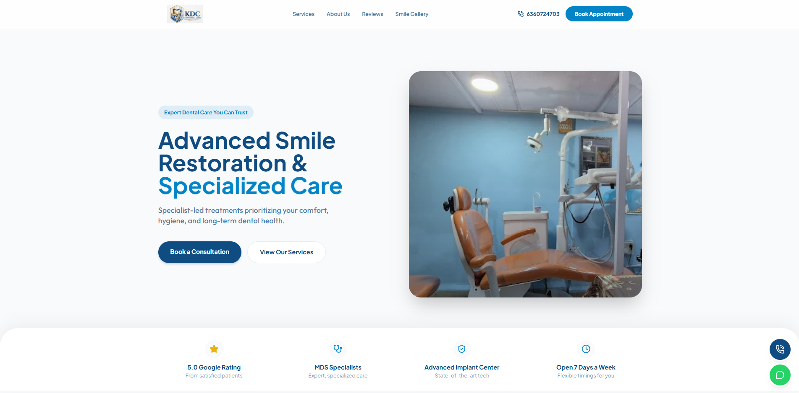
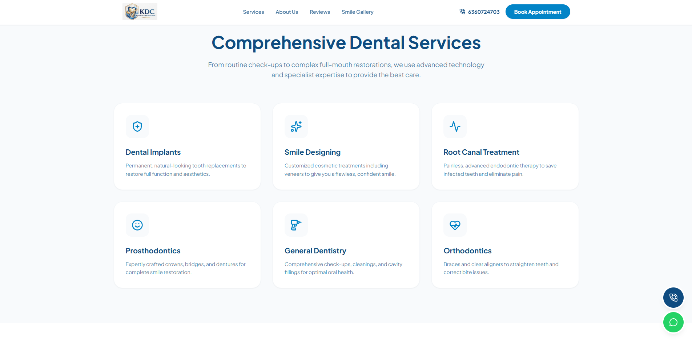
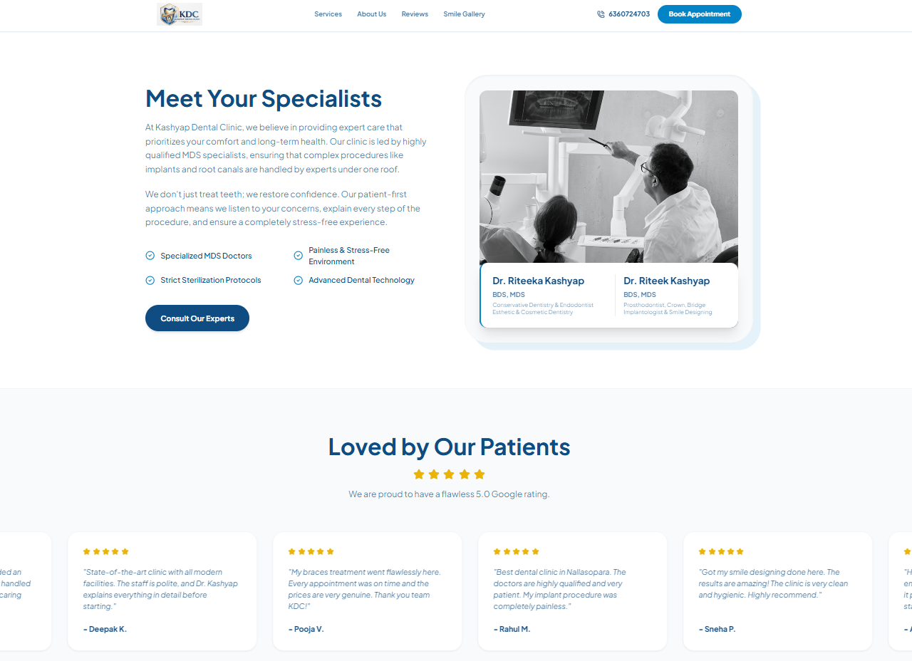
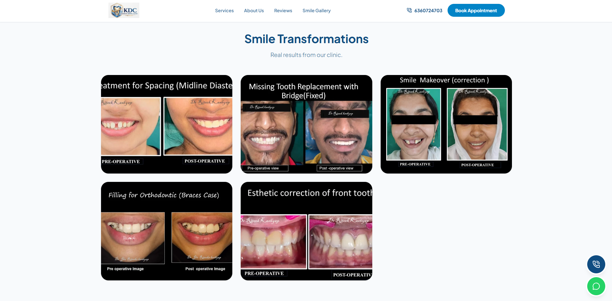

# Kashyap Dental Clinic Website

Kashyap Dental Clinic Website is a polished single-page marketing site built with React and Vite. It showcases the clinic's services, patient reviews, smile transformation gallery, location, timings, and direct booking/contact actions in a mobile-friendly landing page.

<p align="center">
  
  
  
  
</p>

## Overview

This project is designed as a public-facing clinic showcase and lead-generation site. Visitors can quickly explore the clinic, understand the treatments offered, read social proof, and reach the team through call, WhatsApp, or map directions.

## Live Demo

Add your deployed site here:

- Demo URL: https://kashyapdentalclinic.vercel.app/

## Screenshots

<table>
  <tr>
    <td align="center">
      
      <br />
      <sub>Homepage</sub>
    </td>
    <td align="center">
      
      <br />
      <sub>Services</sub>
    </td>
  </tr>
  <tr>
    <td align="center">
      
      <br />
      <sub>Reviews</sub>
    </td>
    <td align="center">
      
      <br />
      <sub>Smile Gallery</sub>
    </td>
  </tr>
</table>


## Badges

[](LICENSE)
[](https://github.com/VaibhavS-17/KDC/issues)
[](https://github.com/VaibhavS-17/KDC)

If you add a GitHub Actions workflow later, you can add a build badge above these.

### What the site includes

- Timed preloader with clinic branding
- Sticky navigation with section links and a booking CTA
- Hero section with consultation and services calls to action
- Trust banner with clinic proof points
- Services grid with modal inquiry flow
- About section with clinic and doctor context
- Patient testimonials carousel
- Smile transformation gallery sourced from `public/gallery`
- Location, timings, and embedded Google Maps section
- Floating phone and WhatsApp contact widget

## Tech Stack

- React 19
- Vite
- Tailwind CSS
- GSAP and `@gsap/react`
- Lucide React icons
- `clsx` and `tailwind-merge`
- `@vercel/analytics`

## Project Structure

```text
src/
  App.jsx                Main app shell and section composition
  main.jsx               React entry point
  index.css              Global styles and theme layer
  setupTests.js          Vitest test setup
  components/
    Preloader.jsx        Initial loading screen
    Navbar.jsx           Sticky navigation and CTA buttons
    Hero.jsx             Main landing section
    TrustBanner.jsx      Proof points and clinic highlights
    Services.jsx         Treatment cards and inquiry modal
    AboutUs.jsx          Clinic and doctor introduction
    Testimonials.jsx     Reviews carousel and gallery
    Footer.jsx           Location, timings, map, and footer links
    FloatingContact.jsx  Persistent phone and WhatsApp shortcuts
```

## Featured Services

The site currently highlights:

- Dental Implants
- Smile Designing
- Root Canal Treatment
- Prosthodontics
- General Dentistry
- Orthodontics

## Clinic Information

- Clinic name: Kashyap Dental Clinic
- Address: Satyam Shivam Shopping Centre, Near Nallasopara Railway Station, Nallasopara East, Maharashtra
- Phone: 6360724703
- WhatsApp: 8310112284
- Google Maps: https://share.google/DCXZnudvhlELSjrmi
- Hours: Monday to Saturday 10:00 AM - 10:00 PM, Sunday 10:00 AM - 6:00 PM

## License
This project is licensed under the MIT License. See the [LICENSE](LICENSE) file for details.